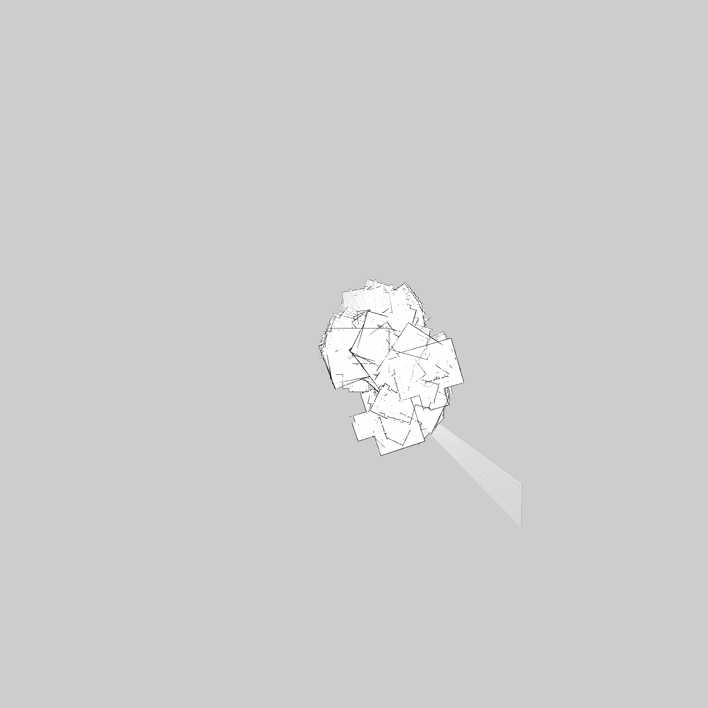
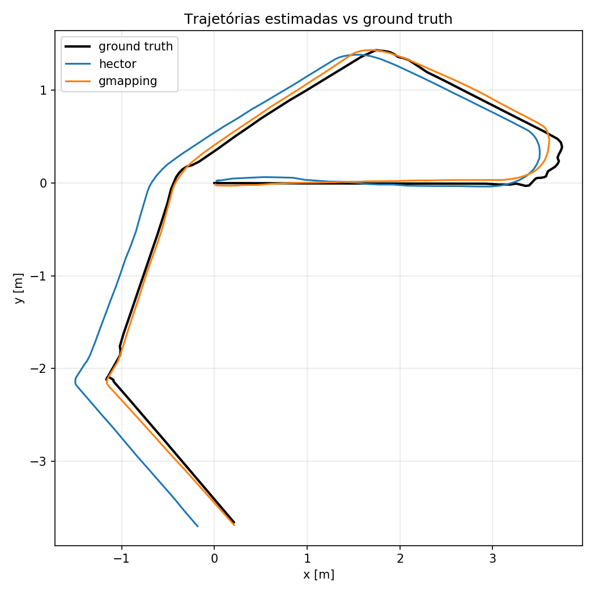
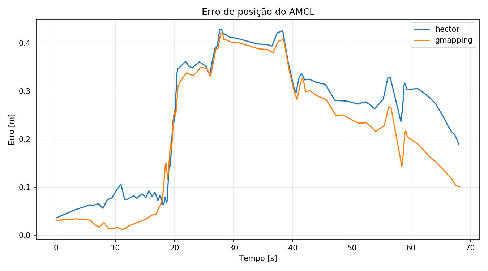
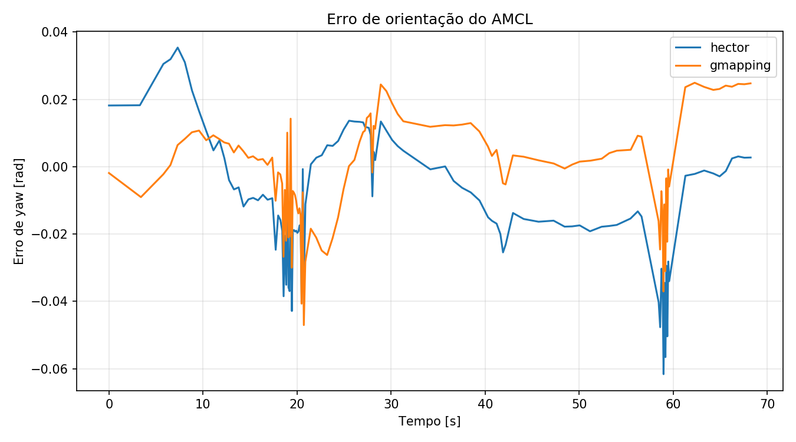

# Localização Robótica — Atividade 3

Pacote ROS Noetic para gravar uma trajetória do Husky no LaR simulado e gerar
mapas comparáveis com Hector SLAM e GMapping. Também é gravado uma nova bag com uma trajetoria do robô para avaliação com AMCL usando os mapas gerados individualmente com o ground truth do gazebo. 

## Configuracao do ambiente

O projeto possui um `dockerfile` para preparar o ambiente ROS/Gazebo usado nos testes. Baixe esse arquivo individualmente, coloque-o em uma pasta de trabalho e gere a imagem Docker a partir dele:

```bash
docker build -t localiza_o_robotica_ros -f dockerfile .
```

Depois que a imagem for criada, inicie o container:

```bash
docker run -it \
  --env DISPLAY=$DISPLAY \
  --env QT_X11_NO_MITSHM=1 \
  --volume /tmp/.X11-unix:/tmp/.X11-unix:rw \
  --network host \
  --name ros_lar_run \
  <sua_imagem>
```

Substitua `<sua_imagem>` pelo nome da imagem gerada no passo anterior, por exemplo `ros_lar_run`.

No host, antes de abrir interfaces graficas pelo Docker, libere o acesso ao X11:

```bash
xhost +local:docker
```

Dentro do container, clone este repositorio dentro de `~/catkin_ws/src/`:

```bash
mkdir -p ~/catkin_ws/src
cd ~/catkin_ws/src
git clone <link-do-repositorio>
```

Somente depois disso compile o workspace:

## 1. Preparação

```bash
rosrun localiza_o_robotica_at3 check_dependencies.sh --install
cd ~/catkin_ws && catkin build localiza_o_robotica_at3
source devel/setup.bash
```

## 2. Simulação e gravação

Sempre que abrir um novo terminal no container, carregue o ambiente:

```bash
docker exec -it ros_lar_run bash
export LIBGL_ALWAYS_SOFTWARE=1
source /opt/ros/noetic/setup.bash
source ~/catkin_ws/devel/setup.bash
```

Terminal 1 — inicie o LaR com o LMS1XX em `/front/scan` e sem SLAM online:

```bash
rosrun localiza_o_robotica_at3 start_simulation.sh
```

Terminal 2 — abra o controle e selecione **`/cmd_vel`**:

```bash
rosrun rqt_robot_steering rqt_robot_steering
```

Terminal 3 — grave:

```bash
rosrun localiza_o_robotica_at3 record_mapping.sh
```
No joystick gerado no Terminal 2 selecione o topico de comando do Husky, normalmente `/husky_velocity_controller/cmd_vel` ou `/cmd_vel`.
 Manipule o robo com o joystick e ao cobrir bem o laboratório, pare a gravacao no Terminal 3 com `Ctrl+C`.

## 3. Hector SLAM

Feche o Gazebo e o ROS master nos outros terminais abertos. Execute:

```bash
rosrun localiza_o_robotica_at3 generate_hector_map.sh
```

Por padrão são criados `maps/hector/lar_hector.pgm`, `lar_hector.yaml`,
`lar_hector.png` e `hector.log`.

Mapa gerado com Hector SLAM:



## 4. GMapping

Depois, também sem Gazebo ou outro ROS master ativo, Execute:

```bash
rosrun localiza_o_robotica_at3 generate_gmapping_map.sh
```

Por padrão são criados `maps/gmapping/lar_gmapping.pgm`, `lar_gmapping.yaml`,
`lar_gmapping.png` e `gmapping.log`.

Mapa gerado com GMapping:


Ambos reproduzem a mesma bag e salvam em `/maps/` depois do replay.

## 5. Gravar uma trajetória exclusiva para localização

Com os mapas prontos, precisamos gravar o bag da trajetoria para aplicar o AMCL.

Terminal 1 — inicie o LaR com o LMS1XX em `/front/scan` e sem SLAM online:

```bash
rosrun localiza_o_robotica_at3 start_simulation.sh
```

Terminal 2 — abra o controle e selecione **`/cmd_vel`**:

```bash
rosrun rqt_robot_steering rqt_robot_steering
```

Terminal 3 — grave uma nova trajetória com:

```bash
rosrun localiza_o_robotica_at3 record_localization.sh
```

A saída padrão é `bags/lar_localization.bag`. Essa bag é criada sem SLAM e contém laser, TF, odometria e ground truth.

Faça fazer uma trajetoria pelo mapa com o Husky, pressione `Ctrl+C` quando terminar. Depois feche Gazebo e qualquer `roscore`.

## 6. Localização AMCL com o mapa Hector

Execute:

```bash
rosrun localiza_o_robotica_at3 localize_hector_map.sh
```

O mapa carregado será `maps/hector/lar_hector.yaml` e o resultado ficará em `results/localization/amcl_hector.bag`.

## 7. Localização AMCL com o mapa GMapping

Use exatamente a mesma bag de entrada:

```bash
rosrun localiza_o_robotica_at3 localize_gmapping_map.sh
```

O mapa carregado será `maps/gmapping/lar_gmapping.yaml` e o resultado ficará em `results/localization/amcl_gmapping.bag`.

## 8. Comparar AMCL com o ground truth

Depois de gerar as duas bags de localização, execute:

```bash
rosrun localiza_o_robotica_at3 compare_amcl_results.py
```

O comparador lê diretamente:

```text
results/localization/amcl_hector.bag
results/localization/amcl_gmapping.bag
```

As métricas incluem:

- erro instantâneo, médio, RMSE e erro final de posição;
- erro médio absoluto, RMSE e erro final de orientação em yaw;
- desvio padrão, percentil 95 e erro máximo;
- variação média do erro entre atualizações;
- taxa média e maior intervalo entre atualizações do AMCL;
- covariância média informada pelo AMCL.

Os resultados são gravados em `results/metrics/`:

```text
amcl_hector_metrics.csv
amcl_hector_summary.txt
amcl_gmapping_metrics.csv
amcl_gmapping_summary.txt
comparison_summary.csv
comparison_report.md
comparison_position_error.png
comparison_yaw_error.png
comparison_trajectories.png
```
## Resultados e discussão

### Comparação qualitativa dos mapas

Comparando os arquivos PNG, os dois mapas gerados são bastante parecidos, sem grandes distinções. Entretanto, o Hector SLAM parece ter detectado melhor alguns detalhes e ruídos do ambiente, como um dos pés da mesa na parte inferior do mapa, que não aparece no resultado do GMapping. Portanto, nesta análise qualitativa, o mapa do Hector SLAM foi considerado ligeiramente melhor, embora a diferença seja pequena.

| Hector SLAM | GMapping |
| :---: | :---: |
|  |  |

### Resultados quantitativos da localização com AMCL

As métricas foram obtidas a partir da mesma trajetória. Os valores completos estão em `results/metrics/comparison_summary.csv`.

#### Erros de posição

| Métrica | Hector SLAM | GMapping |
| --- | ---: | ---: |
| Erro médio (m) | 0,250224 | **0,217926** |
| RMSE (m) | 0,278254 | **0,252217** |
| Erro final (m) | 0,190349 | **0,101475** |
| Desvio padrão (m) | **0,121711** | 0,126971 |
| Percentil 95 (m) | 0,418044 | **0,406654** |
| Erro máximo (m) | 0,429126 | **0,421371** |
| Variação média entre atualizações (m) | 0,012589 | **0,011784** |

#### Erros de orientação

| Métrica | Hector SLAM | GMapping |
| --- | ---: | ---: |
| Erro absoluto médio de yaw (rad) | 0,013627 | **0,013562** |
| RMSE de yaw (rad) | **0,018122** | 0,019441 |
| Erro final absoluto de yaw (rad) | 0,051501 | **0,050459** |
| Desvio padrão do erro absoluto (rad) | **0,011946** | 0,013930 |
| Percentil 95 do erro absoluto (rad) | **0,038115** | 0,048880 |

#### Atualização e covariância do AMCL

| Métrica | Hector SLAM | GMapping |
| --- | ---: | ---: |
| Covariância média em XY | **0,019302** | 0,020724 |
| Covariância média de yaw | **0,002374** | 0,002436 |
| Taxa média de atualização (Hz) | **1,689686** | 1,685723 |
| Maior intervalo entre atualizações (s) | **3,26** | 3,30 |
| Maior diferença temporal do pareamento (s) | 0,02 | 0,02 |







Apesar de o Hector SLAM ter apresentado vantagens pequenas na orientação, na covariância estimada e na regularidade das atualizações, o mapa do GMapping permitiu a melhor localização com AMCL neste ensaio. Ele produziu menor erro médio de posição, menor RMSE de posição e um erro final aproximadamente 46,7% menor (0,101 m contra 0,190 m). Como a diferença no erro médio de yaw foi mínima e o GMapping foi melhor nas principais métricas de posição, seus resultados, de maneira geral, foram superiores para esta trajetória.
